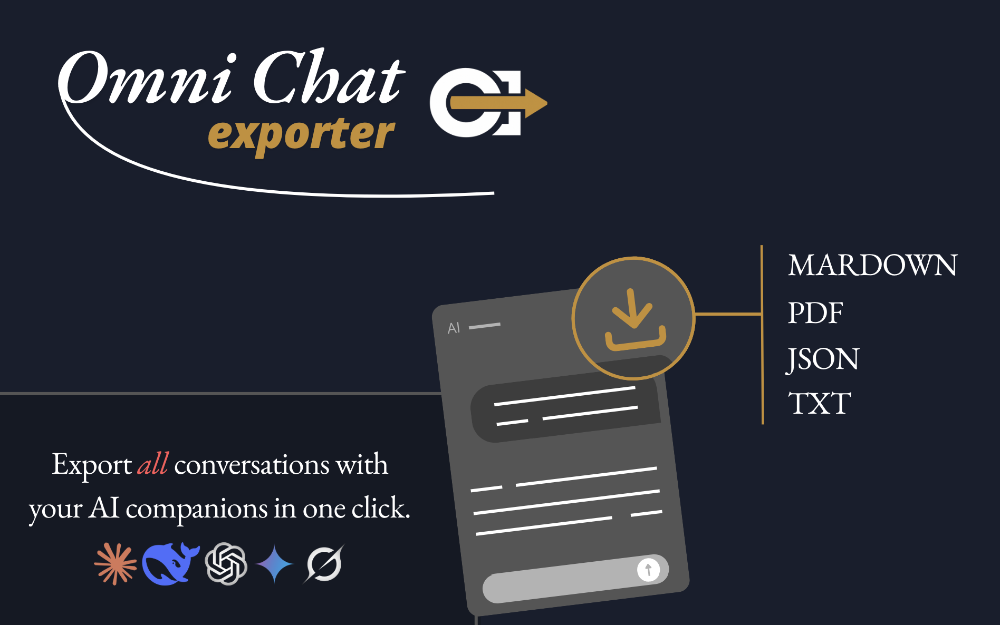

# OmniChat Exporter

## Universal AI conversation export tool.

[OmniChat Exporter](https://greasyfork.org/scripts/567743-omnichat-exporter-export-any-ai-chat-instantly) allows you to export and download conversations from **ChatGPT**, **Gemini**, **Claude**, **Grok**, and **DeepSeek** in **TXT, PDF, JSON, or Markdown format** per message or full thread.

**Fast. Clean. Reliable.**

---

## What OmniChat Exporter does

- Adds export controls directly inside supported AI platforms
- Allows exporting a full conversation thread
- Allows exporting individual messages
- Generates structured and clean output files
- Works instantly in the browser

Everything runs locally.

---

## Main Features

### Export Control

- Full conversation export
- Per-message export
- Clean file structure depending on format
- Native UI integration on each supported platform

---

## Supported Formats

- **TXT** - simple and universal  
- **Markdown** - perfect for documentation and reuse  
- **JSON** - structured data for automation  
- **PDF** - browser-generated document, ready to share  

---

## Supported Platforms

- ChatGPT
- Gemini
- Claude
- Grok
- DeepSeek

---

## Privacy

All export operations are performed **locally in the browser**.

No conversation data is sent to external servers for file generation.  
PDF files are generated client-side using **pdfmake**.

---

## Third-Party Library

### pdfmake

Used for generating PDF files directly in the browser.

- Website: <https://pdfmake.github.io/docs/>
- Source: <https://github.com/bpampuch/pdfmake>
- License: MIT

No chat content is transmitted to any external PDF service.

---

## Installation

1. Install a userscript manager such as [Tampermonkey](https://www.tampermonkey.net/).
2. Install the script from [GreasyFork](https://greasyfork.org/scripts/567743-omnichat-exporter-export-any-ai-chat-instantly).
3. Open a supported AI platform.
4. Use the export controls directly in the interface.

---

## Feedback and Contributions

Feedback and improvement suggestions are welcome via:

- [GreasyFork feedback](https://greasyfork.org/scripts/567743-omnichat-exporter-export-any-ai-chat-instantly/feedback)  
- [GitHub Issues](https://github.com/DREwX-code/omnichat-exporter/issues) 

---

## Author

Developed and maintained by **Dℝ∃wX** (GitHub: [DREwX-code](https://github.com/DREwX-code)).  
Engineered for performance, precision, and long-term evolution.

---

## License

This project is licensed under the **Apache License 2.0**.  
You are free to use, modify, and redistribute it under the terms of the license.
